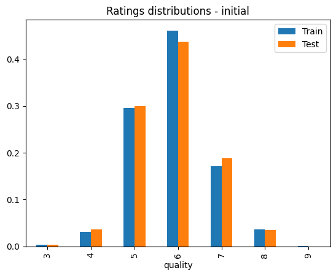

# Lab 1 — Logistic Regression & Evaluation Metrics

**Student:** Ahmed Al-Muharaq  
**Institution:** Université Marie & Louis Pasteur (UMLP), EIPHI Graduate School  
**Program:** Master 1 — LAS (Embedded Computing Systems / IoT)  
**Course:** Machine Learning for IoT  
**Supervisor:** Michel Salomon  

---

## Overview

This lab introduces the fundamentals of supervised machine learning through a **multi-class classification** task. The goal is to predict the quality rating of white wines (scores 3–9) from physicochemical measurements using **Logistic Regression**.

---

## Dataset

| Property | Value |
|----------|-------|
| Source | UCI Machine Learning Repository — [Wine Quality](https://archive.ics.uci.edu/ml/machine-learning-databases/wine-quality/winequality-white.csv) |
| Type | White Wine |
| Samples | 4,898 |
| Features | 11 physicochemical attributes + color |
| Target | Quality score (integer 3–9) |

**Features include:** fixed acidity, volatile acidity, citric acid, residual sugar, chlorides, free/total sulfur dioxide, density, pH, sulphates, alcohol.

---

## Steps Completed

### 1. Data Loading & Exploration
- Loaded the UCI Wine Quality dataset using `pandas`
- Inspected shape, column types, and first rows
- Identified non-numeric `color` column (string) and converted it to binary (0 = white, 1 = red)

### 2. Quality Distribution Visualization


The dataset is **heavily imbalanced**: ratings 5 and 6 dominate (~80% of all samples), while extreme ratings (3 and 9) are very rare.

### 3. Train / Test Split — Stratification

**Before stratification** — distributions differ between splits:



**After stratification** — distributions are balanced:


Using `stratify=y` in `train_test_split` ensures that each quality class is proportionally represented in both the training (70%) and test (30%) sets.

### 4. Feature Preprocessing
- Identified `color` as the only categorical/non-numeric feature
- Encoded it as a binary integer (0 = white, 1 = red)
- Applied `StandardScaler` before training Logistic Regression to ensure convergence

### 5. Logistic Regression Training & Evaluation

```
              precision    recall  f1-score   support

           3       1.00      0.17      0.29         6
           4       0.70      0.14      0.24        49
           5       0.61      0.55      0.58       437
           6       0.53      0.76      0.62       660
           7       0.51      0.21      0.30       264
           8       0.00      0.00      0.00        53
           9       0.00      0.00      0.00         1

    accuracy                           0.55      1470
   macro avg       0.48      0.26      0.29      1470
weighted avg       0.54      0.55      0.51      1470
```

**Overall accuracy: 55%**

---

## Key Concepts Explained

| Metric | Definition |
|--------|-----------|
| **Support** | Number of actual samples in each class in the test set |
| **Precision** | TP / (TP + FP) — how accurate positive predictions are |
| **Recall** | TP / (TP + FN) — how many actual positives are found |
| **F1-Score** | Harmonic mean of Precision and Recall |
| **Macro Avg** | Unweighted average across all classes (treats all classes equally) |
| **Weighted Avg** | Average weighted by class support (accounts for imbalance) |

---

## Key Findings

1. **Feature scaling is critical** — without `StandardScaler`, the L-BFGS solver fails to converge due to the wide range of feature scales (e.g., `total sulfur dioxide` vs. `chlorides`)

2. **Class imbalance dominates performance** — the model learns well for classes 5 and 6 (most samples) but completely fails on classes 8 and 9 (too few samples to learn from)

3. **Logistic Regression assumes linearity** — the relationship between wine features and quality scores is likely non-linear, making this a ceiling on LR performance

4. **Possible improvements:**
   - Use `class_weight='balanced'` in `LogisticRegression`
   - Apply SMOTE oversampling for rare classes
   - Group ratings into binary classes (e.g., good/bad)
   - Switch to non-linear models (→ Lab 2)

---

## Files

| File | Description |
|------|-------------|
| `Lab1_LogisticRegression_Metrics.ipynb` | Complete Jupyter notebook with code, outputs, and analysis |
| `images/` | Extracted plots: quality distribution, train/test split histograms |
