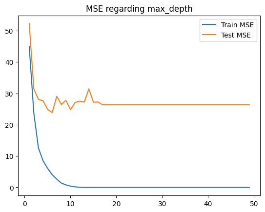
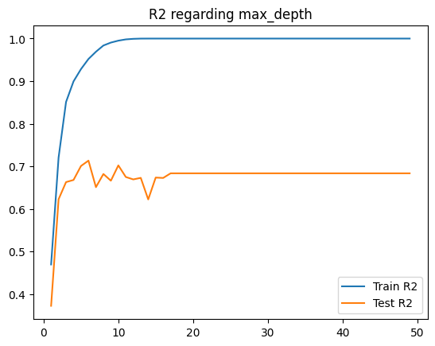
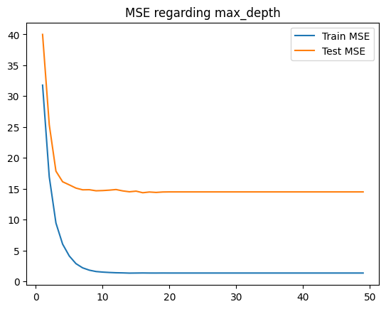
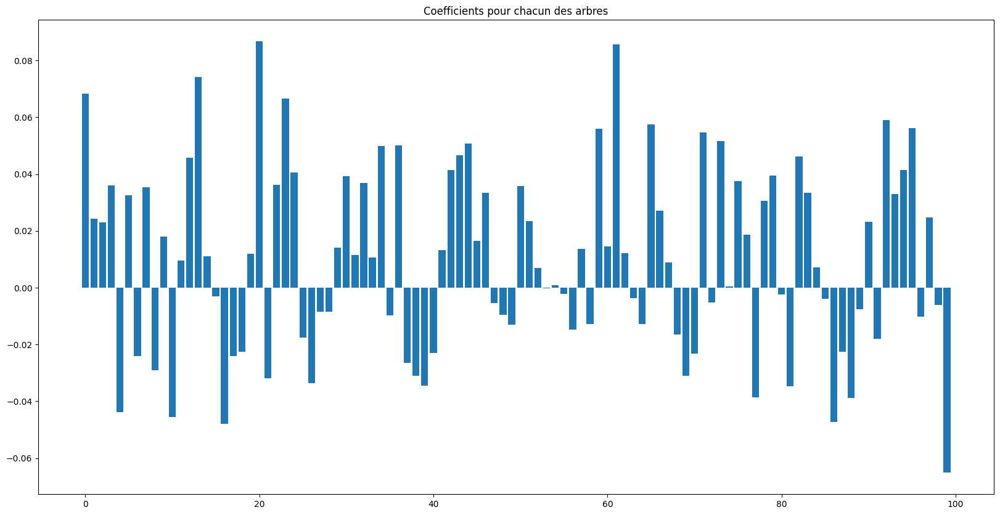
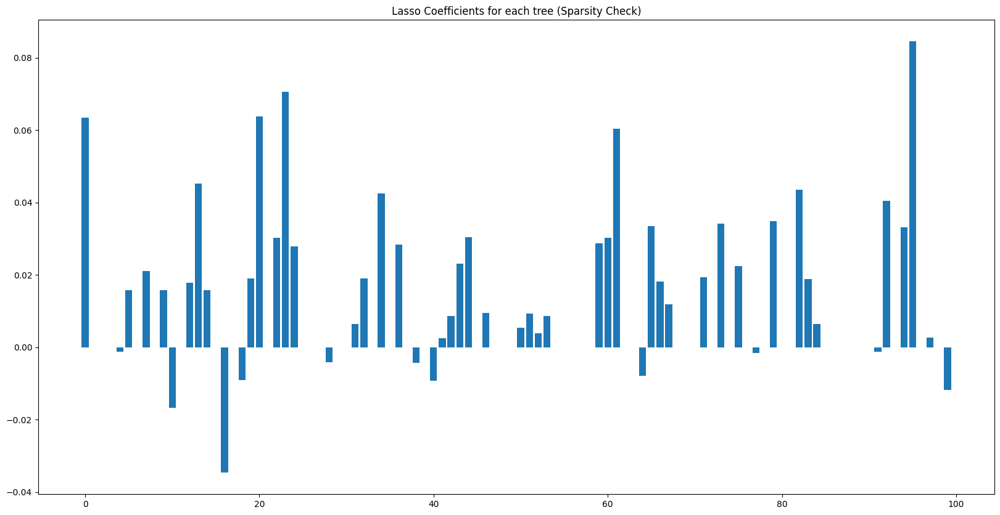

# Lab 2 — Decision Trees & Random Forests (Regression)

**Student:** Ahmed Al-Muharaq  
**Institution:** Université Marie & Louis Pasteur (UMLP), EIPHI Graduate School  
**Program:** Master 1 — LAS (Embedded Computing Systems / IoT)  
**Course:** Machine Learning for IoT  
**Supervisor:** Michel Salomon  

---

## Overview

This lab explores **tree-based machine learning** methods applied to a regression problem. Using the classic **Boston Housing** dataset, the notebook covers Decision Trees, Random Forests, and ensemble stacking techniques — demonstrating the progression from a single tree to powerful ensemble models.

---

## Dataset

| Property | Value |
|----------|-------|
| Source | Scikit-learn built-in (`load_boston`) |
| Task | Regression — predict median house value (MEDV) |
| Samples | 506 |
| Features | 13 (CRIM, ZN, INDUS, CHAS, NOX, RM, AGE, DIS, RAD, TAX, PTRATIO, B, LSTAT) |
| Target | MEDV — Median value of owner-occupied homes (in $1000s) |

**Key Features:**
- `RM` — average number of rooms per dwelling
- `LSTAT` — % lower-status population in the neighborhood
- `NOX` — nitric oxide concentration (pollution proxy)

---

## Steps Completed

### 1. Regression Metrics

The lab begins with a thorough review of metrics for regression:

| Metric | Formula | Notes |
|--------|---------|-------|
| **Max Error (ME)** | max|y - ŷ| | Sensitive to outliers |
| **MAE** | mean(|y - ŷ|) | Robust to outliers |
| **MSE** | mean((y - ŷ)²) | Penalizes large errors more |
| **RMSE** | √MSE | Same units as target |
| **R²** | 1 - SS_res/SS_tot | 1 = perfect, 0 = baseline |

### 2. Decision Tree Regressor

A single Decision Tree is trained on the Boston dataset:

- Trained with varying `max_depth` values (1 to 50)
- Tracked **train MSE** and **test MSE** at each depth

**Observation:** The optimal depth is around 3–6. Beyond that, the model overfits — training MSE drops to near 0 while test MSE increases significantly.

### 3. Random Forest Regressor

Random Forests aggregate predictions from 100 individual decision trees:

- Explored feature importances
- Varied `max_depth` from 1 to 50

Random Forests are significantly more robust to overfitting compared to individual decision trees. The test MSE remains low and stable across a wider range of depths.

### 4. Individual Tree Predictions

Visualized predictions from each individual tree in the forest:

The spread of individual tree predictions illustrates the variance-reduction effect of averaging.

### 5. Meta-Model (Stacking)

A second-level **Linear Regression meta-model** and a **Lasso meta-model** are trained on the outputs of the 100 individual trees:

The Lasso meta-model automatically selects a subset of the trees (53 out of 100 with non-zero weight), performing automatic feature selection in the ensemble.

### 6. Feature Importances

**Top predictors:**
- **RM** (rooms per dwelling) — strongest positive driver of house value
- **LSTAT** (lower-status population %) — strongest negative driver
- Together they explain the majority of house price variance

---

## Key Findings & Conclusions

| Finding | Detail |
|---------|--------|
| **Best single tree depth** | ~3–6 levels balances bias/variance |
| **Random Forest advantage** | Lower variance, more stable test performance |
| **Top features** | `RM` and `LSTAT` dominate all tree-based importance scores |
| **Stacking benefit** | Meta-model can learn to weight diverse trees optimally |
| **Lasso pruning** | Auto-selects ~53% of trees, reducing complexity without hurting accuracy |

### Overfitting Comparison

| Model | Train R² | Test R² |
|-------|----------|---------|
| Decision Tree (optimal depth) | ~0.95 | ~0.82 |
| Random Forest (optimal depth) | ~0.98 | ~0.88 |

Random Forests consistently outperform individual trees due to the bias-variance trade-off benefit of bagging.

---

## Files

| File | Description |
|------|-------------|
| `Lab2_DecisionTrees_RandomForests.ipynb` | Complete Jupyter notebook with all code and outputs |
| `images/` | Extracted plots: trees, MSE curves, feature importances, meta-model coefficients |
