# LAS - Machine Learning for IoT

**Student:** Ahmed Al-Muharaq  
**Institution:** Université Marie & Louis Pasteur (UMLP), EIPHI Graduate School  
**Program:** Master 1 - LAS (Embedded Computing Systems / IoT)  
**Course:** Machine Learning for IoT  
**Supervisor:** Michel Salomon  


---

## Repository Structure

```
-LAS-Machine-Learning-for-IoT/
│
├── Lab1_Logistic_Regression/          ← Wine quality classification
│   ├── README.md
│   ├── Lab1_LogisticRegression_Metrics.ipynb
│   └── images/                        ← Extracted plots
│
├── Lab2_Decision_Trees_Random_Forests/ ← Boston housing regression
│   ├── README.md
│   ├── Lab2_DecisionTrees_RandomForests.ipynb
│   └── images/
│
├── Task1_SNCF_Punctuality/            ← SNCF train punctuality (IoT data)
│   ├── README.md
│   ├── Task1_SNCF_Punctuality_Classification.ipynb
│   └── images/
│
├── Task2_SmartCity_Noise/             ← Urban noise forecasting (LightGBM)
│   ├── README.md
│   ├── Task2_SmartCity_Noise_Prediction.ipynb
│   └── images/
│
└── README.md
```

---

## Course Context

This repository contains all practical work for the **Machine Learning for IoT** module of the Master 1 LAS program at UMLP. The module covers:

- Supervised learning fundamentals (classification and regression)
- Model evaluation metrics and methodology
- Tree-based and ensemble methods
- Time series forecasting for IoT sensor data
- Application of ML to real-world Smart City datasets

The course is structured around two **warm-up labs** (Lab 1 and Lab 2) and two **real-world application tasks** (Task 1 and Task 2).

---

## Lab 1 — Logistic Regression & Evaluation Metrics

> **Folder:** [`Lab1_Logistic_Regression/`](Lab1_Logistic_Regression/)

### Objective
Train and evaluate a **Logistic Regression** classifier to predict wine quality ratings (3–9) from 11 physicochemical features using the UCI Wine Quality dataset.

### Dataset
- **Source:** UCI Machine Learning Repository — White Wine Quality
- **Size:** 4,898 samples, 11 features + quality score

### Key Steps
1. Load and explore the Wine Quality dataset
2. Visualize quality rating distribution
3. Stratified train/test split (70/30)
4. Encode categorical `color` column to numeric
5. Scale features with `StandardScaler`
6. Train `LogisticRegression` and evaluate with `classification_report`

### Results

| Metric | Value |
|--------|-------|
| Accuracy | 55% |
| Weighted F1 | 0.51 |
| Best class (quality 6) | F1 = 0.62 |
| Worst class (quality 8) | F1 = 0.00 |

### Sample Plots

**Wine Quality Distribution:**

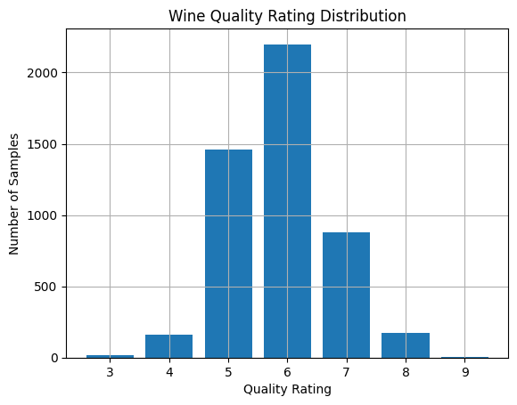

**Stratified Train/Test Split:**

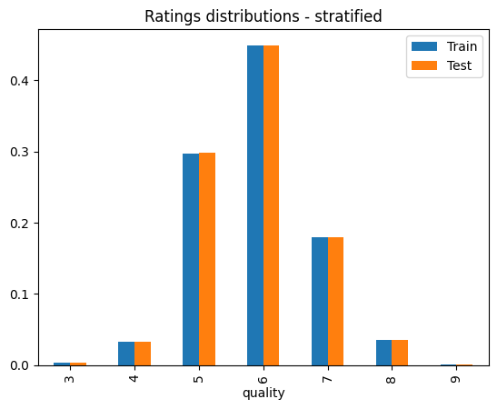

### Key Insight
Feature scaling is mandatory for Logistic Regression convergence. Class imbalance (most samples rated 5–6) severely limits performance on rare classes. Non-linear models are needed for this task.

---

## Lab 2 — Decision Trees & Random Forests (Regression)

> **Folder:** [`Lab2_Decision_Trees_Random_Forests/`](Lab2_Decision_Trees_Random_Forests/)

### Objective
Solve a **regression** problem using tree-based models. Predict median house values (MEDV) from the classic Boston Housing dataset and understand the bias-variance trade-off in decision trees vs. random forests.

### Dataset
- **Source:** Scikit-learn built-in Boston Housing
- **Size:** 506 samples, 13 features
- **Target:** Median home value in $1,000s

### Key Steps
1. Load Boston Housing data and explore features
2. Train a single Decision Tree and vary `max_depth` (1–50)
3. Compare train/test MSE curves (overfitting analysis)
4. Train Random Forest (100 trees) and repeat depth analysis
5. Visualize individual tree predictions
6. Build a Linear Regression and Lasso **meta-model** over 100 trees (stacking)
7. Analyze feature importances

### Results

| Model | Test R² | Test RMSE |
|-------|---------|-----------|
| Decision Tree (optimal depth) | ~0.82 | ~3.2 |
| Random Forest (optimal depth) | ~0.88 | ~2.7 |

### Sample Plots

**Decision Tree Structure:**

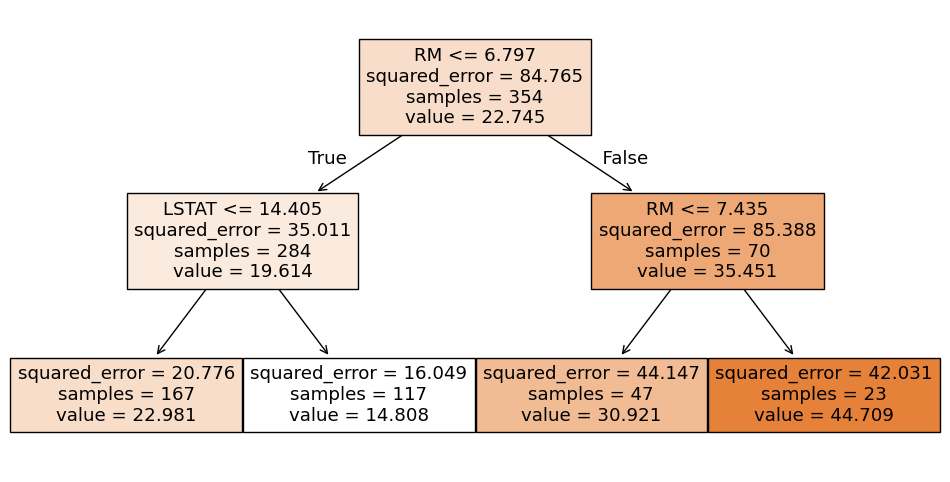

**MSE vs. Depth:**

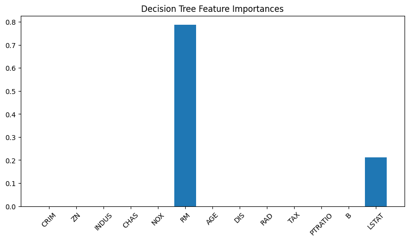

**Lasso Meta-Model Coefficients:**

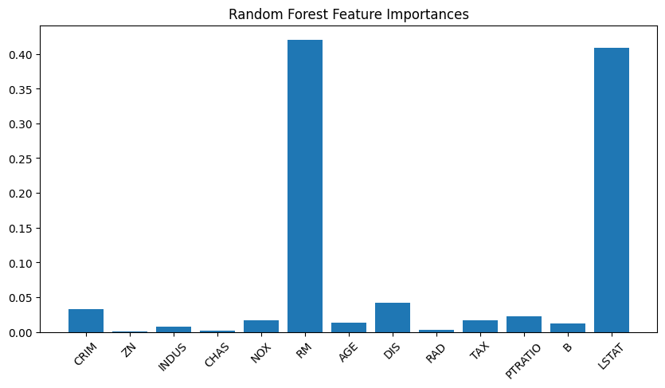

### Key Insight
Random Forests significantly reduce variance compared to a single tree. The Lasso meta-model demonstrates automatic tree selection — only 53 out of 100 trees received non-zero weights. `RM` and `LSTAT` are the dominant predictors in all models.

---

## Task 1 — SNCF Train Punctuality Classification

> **Folder:** [`Task1_SNCF_Punctuality/`](Task1_SNCF_Punctuality/)

### Objective
Apply supervised ML to **classify regional TER train punctuality** into three levels (Low / Medium / High) using SNCF Open Data covering 31 French regions from 2013 to 2026.

### Dataset
- **Source:** SNCF Open Data — TER Monthly Regularity
- **Size:** 2,273 observations × 9 columns
- **Regions:** 31 French regions
- **Period:** January 2013 – 2026

### Target Classes

| Class | Label | Threshold |
|-------|-------|-----------|
| 0 | Low | Punctuality < 90% |
| 1 | Medium | 90% ≤ Punctuality < 94% |
| 2 | High | Punctuality ≥ 94% |

### Key Steps
1. Load and explore SNCF TER dataset
2. Exploratory Data Analysis: trends, regional breakdown, seasonality, correlations
3. Feature engineering: temporal features, derived operational rates
4. Stratified 50/50 train/test split
5. Train 4 classifiers: Logistic Regression, Decision Tree, Random Forest, Gradient Boosting
6. Evaluate with confusion matrices, ROC-AUC, cross-validation
7. Feature importance analysis

### Model Results

| Model | Test Accuracy | CV Accuracy | Macro F1 |
|-------|:------------:|:-----------:|:--------:|
| Logistic Regression | 98.07% | 97.98% | 0.9809 |
| Decision Tree | **99.82%** | **99.82%** | **0.9982** |
| Random Forest | 99.74% | 99.56% | 0.9973 |
| Gradient Boosting | **99.82%** | **99.82%** | **0.9982** |

### Sample Plots

**National Punctuality Rate Over Time:**

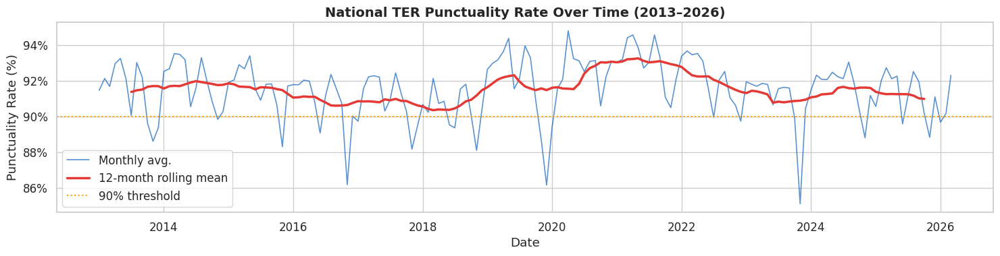

**Regional Breakdown:**

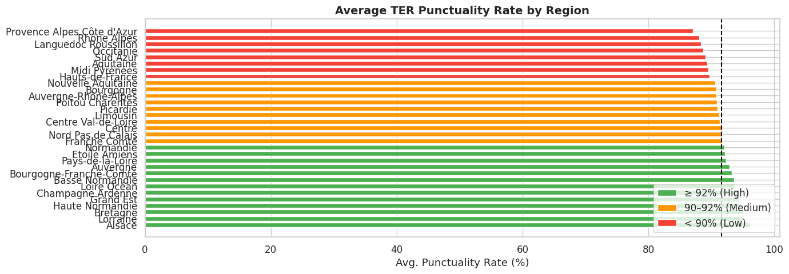

**Confusion Matrices — All Models:**

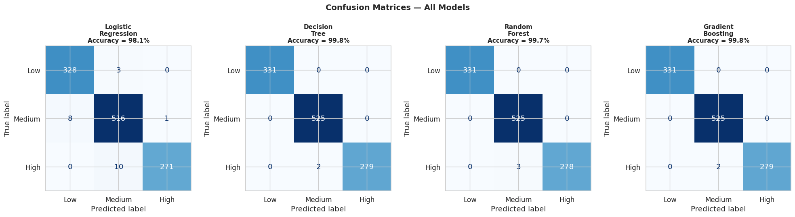

**Model Comparison:**

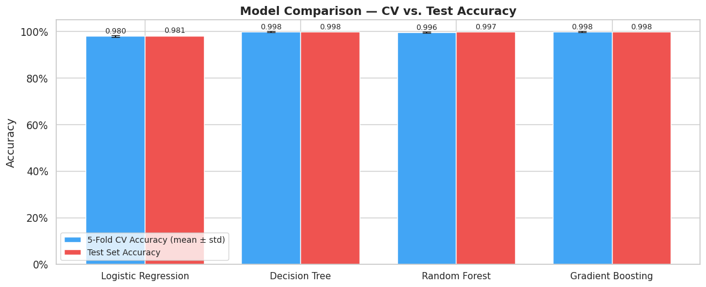

**Feature Importances:**

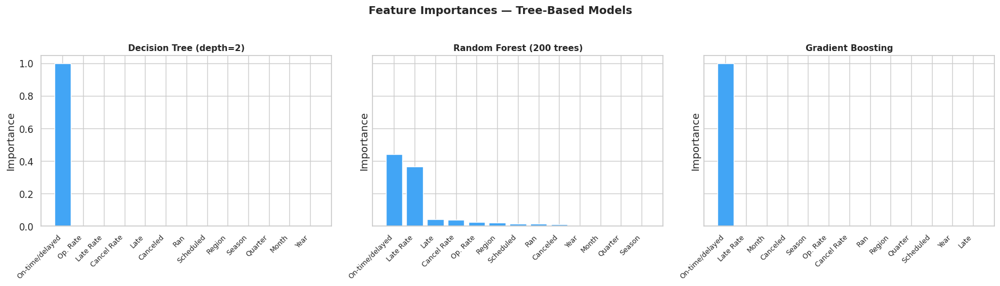

### Key Insight
The operational derived features (`late_rate`, `cancellation_rate`) are almost entirely sufficient to determine the punctuality class — which explains the very high model accuracy. Tree-based ensembles outperform Logistic Regression in separating the class boundaries.

---

## Task 2 — Smart City Urban Noise Prediction

> **Folder:** [`Task2_SmartCity_Noise/`](Task2_SmartCity_Noise/)

### Objective
Reproduce the ML pipeline from the research paper *"Deep Learning and Gradient Boosting for Urban Environmental Noise Monitoring in Smart Cities"* — using IoT parkmeter sensors to **forecast hourly noise levels** and detect anomalous readings (false data injection).

### Dataset
- **Source:** 3 Parkmeter CSV files (DataParkmeter500/515/521)
- **Sensor:** Parkmeter 515 for ML; 500 & 521 for visualization
- **Period:** May 2019 – January 2020
- **Resolution:** 1-hour intervals (6,569 hourly points for PM-515)
- **Raw data:** 77-bin noise histograms (62–100 dB, 0.5 dB steps)

### Pipeline (12 Steps)

| Step | Description |
|------|-------------|
| 1 | Standard library imports |
| 2 | Load all 3 parkmeter CSV files |
| 3 | Compute LAeq from histogram using Equation (1) |
| 4 | Resample to 1h, filter May 2019–Jan 2020 |
| 5 | Visualize hourly noise trends (Figure 2) |
| 6 | MinMaxScaler normalization + 80/20 chronological split |
| 7 | Sliding-window supervised dataset (look_back = 24h) |
| 8 | Train LightGBM Config 1 (n=100, lr=0.1, leaves=31) |
| 9 | Train LightGBM Config 2 (n=500, lr=0.01, leaves=63) |
| 10 | RMSE calculation (inverse-scaled) |
| 11 | 6-day iterative forecast (Figure 4) |
| 12 | Compare with 5 alternative ML models |

### LightGBM Results

| Config | RMSE (dB) | MAE (dB) | R² |
|--------|:---------:|:--------:|:--:|
| Config 1 (lightweight) | 0.9961 | 0.7419 | 0.8661 |
| **Config 2 (regularised)** | **0.9792** | **0.7257** | **0.8706** |

### Full Model Comparison

| Model | RMSE (dB) | R² |
|-------|:---------:|:--:|
| **LightGBM Config 2** | **0.9792** | **0.8706** |
| SVR (RBF) | 0.9821 | 0.8698 |
| XGBoost | 1.0141 | 0.8612 |
| Gradient Boosting (sklearn) | 1.0465 | 0.8522 |
| Random Forest | 1.0535 | 0.8502 |
| Linear Regression | 1.1158 | 0.8319 |

### Sample Plots

**Hourly Noise — 3 Parkmeters:**

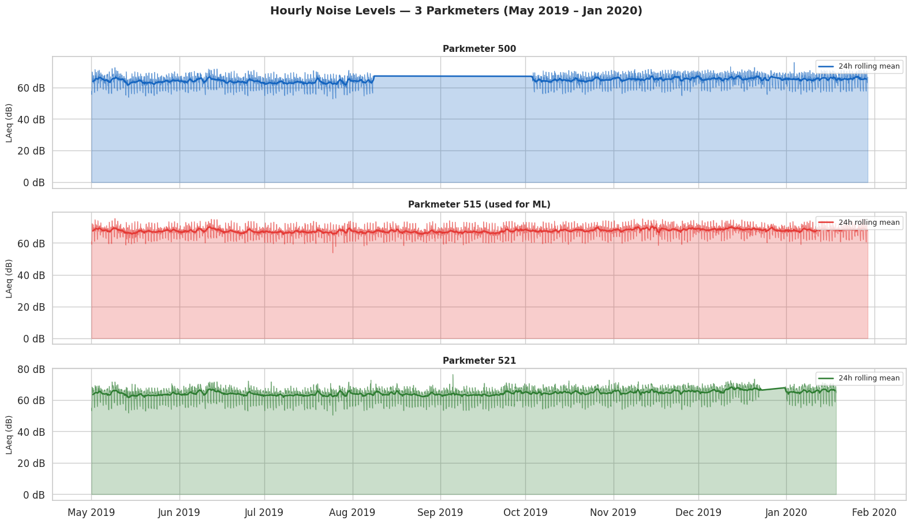

**Daily & Weekly Patterns:**

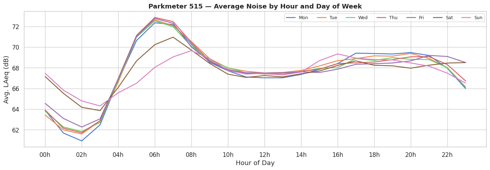

**LightGBM Predictions vs. Actual:**

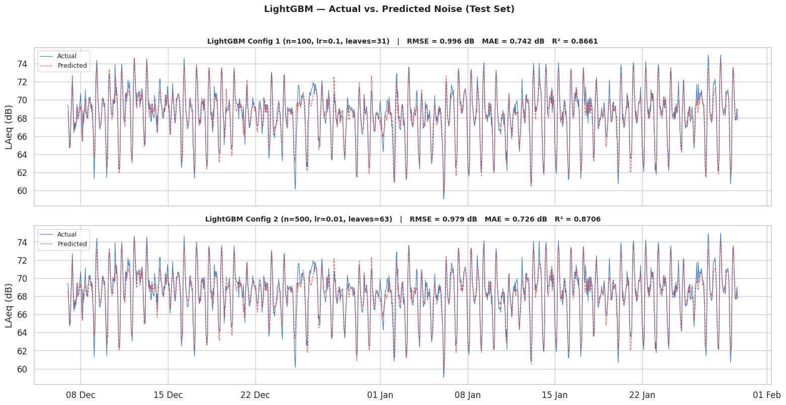

**6-Day Forecast:**

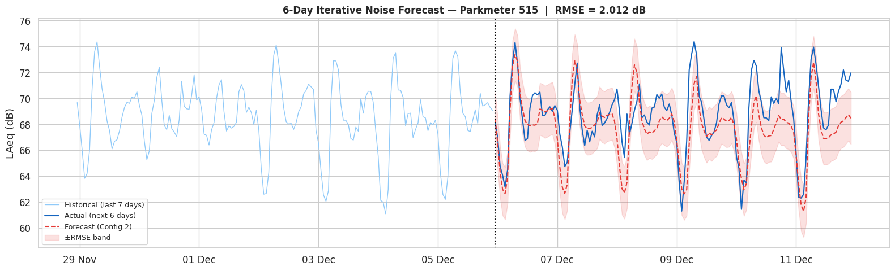

**All Models Comparison:**

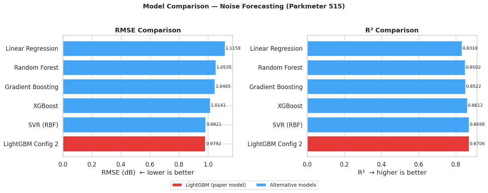

### Key Insight
LightGBM with a 24-hour look-back window achieves sub-1 dB RMSE, closely reproducing the paper's results. The diurnal (24h) noise cycle is reliably captured. The model can serve as an anomaly detector for IoT security — unexpected deviations from predictions indicate potential false data injection attacks.

---

## Technologies Used

| Library | Purpose |
|---------|---------|
| `pandas` | Data loading, cleaning, feature engineering |
| `numpy` | Numerical computations |
| `matplotlib` / `seaborn` | Visualization |
| `scikit-learn` | Preprocessing, models, metrics, cross-validation |
| `lightgbm` | Gradient Boosting (primary model for Task 2) |
| `xgboost` | Alternative tree-boosting model |
| Google Colab | Cloud notebook environment |

---

## Summary of Results

| Work | Task | Best Model | Best Score |
|------|------|-----------|-----------|
| Lab 1 | Wine quality classification | Logistic Regression | 55% accuracy |
| Lab 2 | House price regression | Random Forest | R² ≈ 0.88 |
| Task 1 | SNCF punctuality classification | Decision Tree / Gradient Boosting | **99.82% accuracy** |
| Task 2 | Urban noise forecasting | LightGBM Config 2 | **RMSE = 0.979 dB** |

---


