# Task 1 — SNCF Train Punctuality Classification

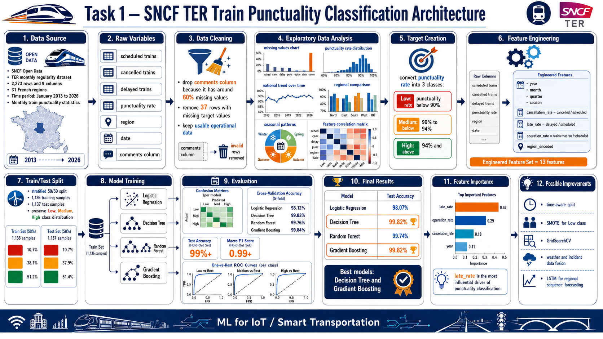

**Student:** Ahmed Al-Muharaq  
**Institution:** Université Marie & Louis Pasteur (UMLP), EIPHI Graduate School  
**Program:** Master 1 — LAS (Embedded Computing Systems / IoT)  
**Course:** Machine Learning for IoT  
**Supervisor:** Michel Salomon  

---

## Overview

This task applies supervised machine learning to **classify the punctuality level of French regional trains (TER)** across 31 French regions. The dataset comes from SNCF Open Data and covers monthly punctuality statistics from 2013 to 2026. The goal is to predict whether a region-month falls into a **Low**, **Medium**, or **High** punctuality class.

---

## Problem Statement

| Property | Value |
|----------|-------|
| **Task type** | Multi-class Classification |
| **Target** | Punctuality class: `Low` / `Medium` / `High` |
| **Dataset** | SNCF TER monthly regularity (`regularite_ter.csv`) |
| **Observations** | 2,273 rows × 9 columns |
| **Regions covered** | 31 French regions |
| **Time period** | January 2013 – 2026 |
| **Models** | Logistic Regression, Decision Tree, Random Forest, Gradient Boosting |

### Punctuality Class Thresholds

| Class | Label | Condition |
|-------|-------|-----------|
| 0 | **Low** | Punctuality rate < 90% |
| 1 | **Medium** | 90% ≤ rate < 94% |
| 2 | **High** | Rate ≥ 94% |

---

## Exploratory Data Analysis

### Missing Values

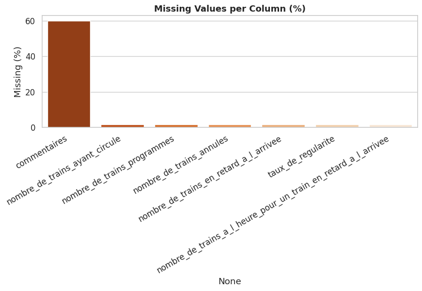

The `commentaires` column has ~60% missing values and is dropped. The 37 rows with missing target values (`taux_de_regularite`) are removed.

### Punctuality Rate Distribution

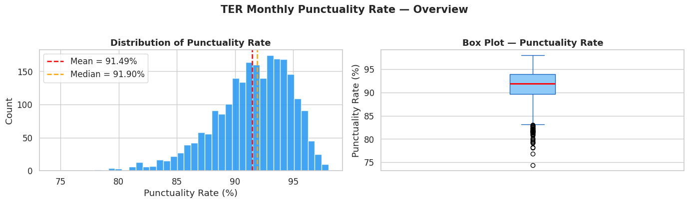

The national mean punctuality rate is ~91.5%, with the distribution slightly left-skewed — most regions perform between 88–96%.

### National Trend Over Time

Clear temporal patterns are visible: dips during winter months, and a notable drop in 2020 (COVID-19 disruption). A 12-month rolling mean reveals a gradual improvement trend over the decade.

### Regional Breakdown

There is an ~8-point spread between the best and worst regions. Some regions consistently underperform (< 90%) while others maintain excellence (> 93%).

### Seasonal Patterns

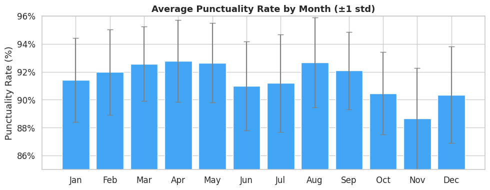

Winter months (December–February) and autumn (October–November) show consistently lower punctuality, likely driven by weather conditions and increased demand.

### Feature Correlations

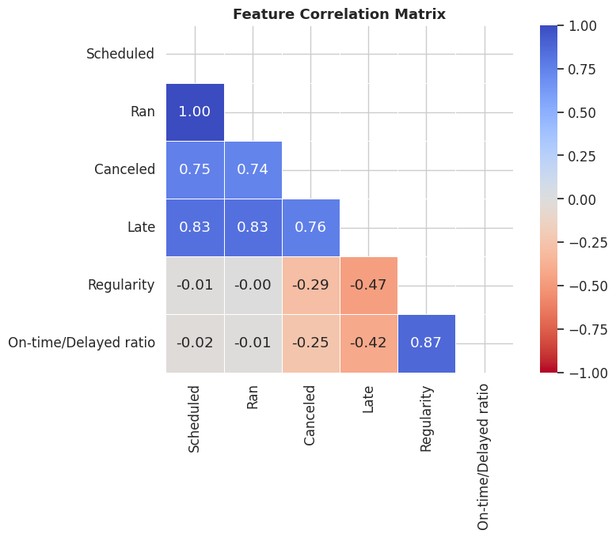

`late_rate` and `cancellation_rate` are strongly negatively correlated with the punctuality target, confirming they are the most informative predictors.

---

## Feature Engineering

In addition to the raw columns, the following features were engineered:

| Feature | Description |
|---------|-------------|
| `year`, `month`, `quarter`, `season` | Temporal decomposition |
| `cancellation_rate` | cancelled / scheduled trains |
| `late_rate` | delayed / scheduled trains |
| `operation_rate` | trains that ran / scheduled trains |
| `region_encoded` | ordinal encoding of the 31 regions |

**Final feature set: 13 features**

---

## Class Distribution

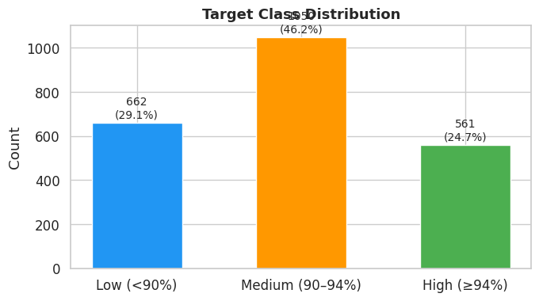

| Class | Count | Proportion |
|-------|-------|-----------|
| Low (<90%) | 662 | 29.1% |
| Medium (90–94%) | 1,049 | 46.2% |
| High (≥94%) | 562 | 24.7% |

The dataset is moderately imbalanced — the Medium class is largest but all three classes have enough samples for learning.

---

## Train / Test Split

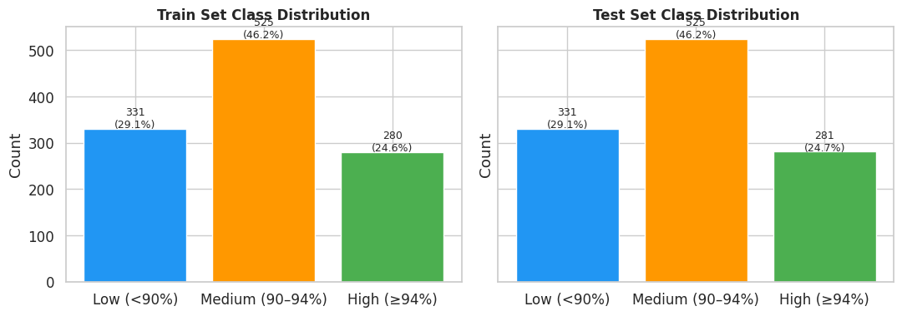

A **stratified 50/50 split** is used, preserving class proportions in both sets (1,136 train / 1,137 test).

---

## Model Training & Results

Four classifiers were trained and compared:

### Decision Tree — Depth Optimization

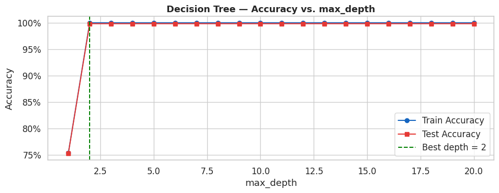

Best performance at `max_depth = 2` — the punctuality classes are very cleanly separable by the operational features.

### Decision Tree Visualization

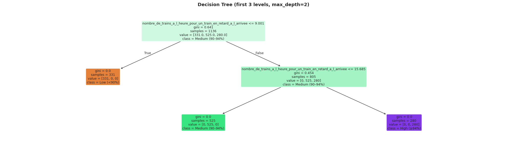

### Random Forest — Depth Optimization

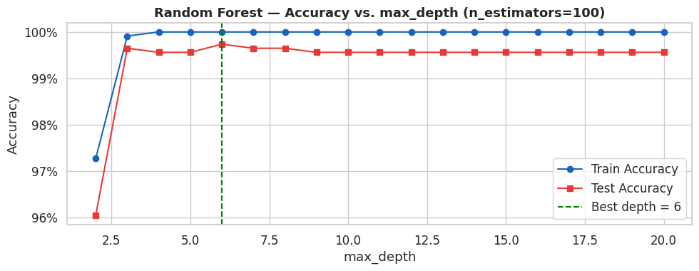

### Confusion Matrices — All Models

### Model Comparison — CV vs. Test Accuracy

### ROC Curves — All Models (One-vs-Rest)

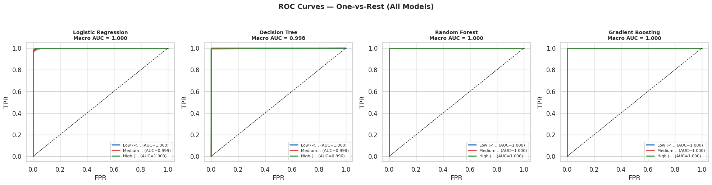

---

## Final Results

| Model | Test Accuracy | CV Accuracy | Macro F1 |
|-------|:------------:|:-----------:|:--------:|
| **Logistic Regression** | 98.07% | 97.98% | 0.9809 |
| **Decision Tree** | **99.82%** | **99.82%** | **0.9982** |
| **Random Forest** | 99.74% | 99.56% | 0.9973 |
| **Gradient Boosting** | **99.82%** | **99.82%** | **0.9982** |

All models achieved above 98% accuracy. The Decision Tree and Gradient Boosting tied for the best performance at **99.82%**.

---

## Feature Importance Analysis

### Tree-Based Feature Importances

### Logistic Regression Coefficients

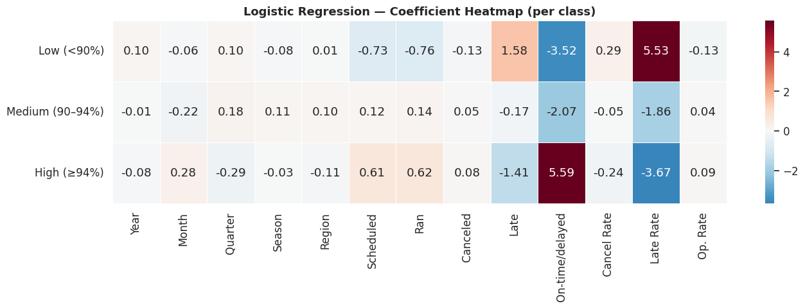

**Most important features across all models:**
1. `late_rate` — delayed trains / scheduled trains
2. `operation_rate` — trains that actually ran
3. `cancellation_rate` — cancelled / scheduled trains
4. `year` — long-term trend

---

## Key Findings

| Finding | Detail |
|---------|--------|
| **Excellent performance** | All 4 models exceed 98% accuracy |
| **Best model** | Decision Tree (depth=2) and Gradient Boosting both achieve 99.82% |
| **Top predictors** | Operational derived features (`late_rate`, `cancellation_rate`) |
| **Seasonal effect** | Winter/autumn months show 2–3% lower punctuality |
| **Regional disparity** | ~8 percentage points between best and worst regions |

### Possible Improvements

1. **Time-aware split** — train on 2013–2022, test on 2023–2026 (prevents data leakage)
2. **SMOTE** oversampling to further balance the Low class
3. **Hyperparameter tuning** via `GridSearchCV`
4. **Multi-dataset fusion** — integrate safety incidents and weather data
5. **LSTM** for sequence-aware regional trend forecasting

---

## Dataset

> **Source:** SNCF Open Data — TER Monthly Regularity (2013–2026)  
> Download: https://data.sncf.com/explore/dataset/regularite-mensuelle-ter

---

## Files

| File | Description |
|------|-------------|
| `Task1_SNCF_Punctuality_Classification.ipynb` | Complete notebook: EDA, feature engineering, 4 models, evaluation |
| `images/` | 16 extracted plots covering EDA, models, and evaluation |
