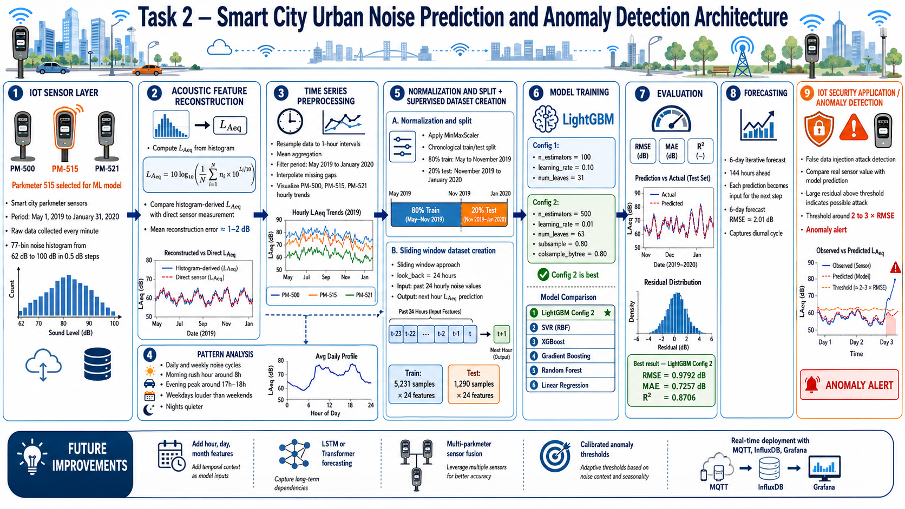
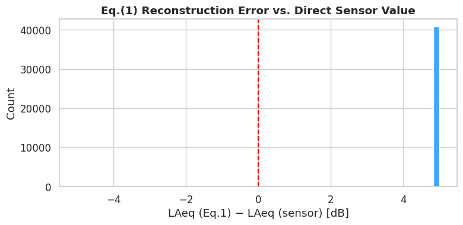
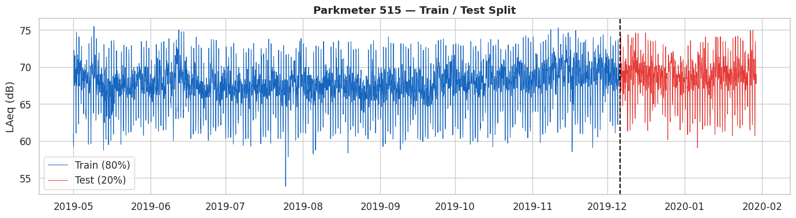
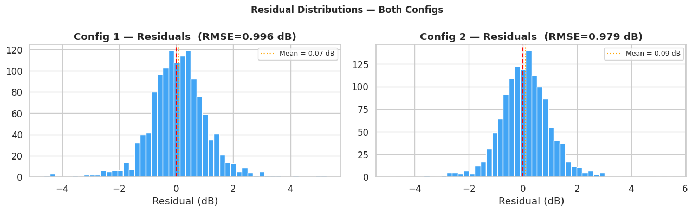
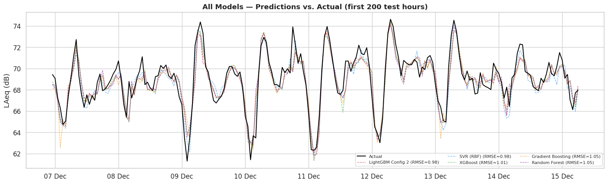

# Task 2 - Smart City Urban Noise Prediction



**Student:** Ahmed Al-Muharaq  
**Institution:** Université Marie & Louis Pasteur (UMLP), EIPHI Graduate School  
**Program:** Master 1 — LAS (Embedded Computing Systems / IoT)  
**Course:** Machine Learning for IoT  
**Supervisor:** Michel Salomon  

---

## Overview

This task reproduces the machine learning pipeline from the research paper:

> **"Deep Learning and Gradient Boosting for Urban Environmental Noise Monitoring in Smart Cities"**

The goal is to **predict hourly urban noise levels** (LAeq in dB) from IoT parkmeter sensors deployed in a city, using a supervised time-series regression approach. The best model is also applied to detect **false data injection attacks** — a key IoT security application.

---

## Problem Statement

| Property | Value |
|----------|-------|
| **Task type** | Time Series Regression (forecasting) |
| **Sensor used** | Parkmeter 515 (for ML) + Parkmeters 500 & 521 (visualization) |
| **Period** | May 1, 2019 – January 31, 2020 |
| **Resolution** | 1-hour intervals |
| **Observations** | 6,569 hourly data points (PM-515) |
| **Main model** | LightGBM (Gradient Boosting) |
| **Evaluation metric** | RMSE (inverse-scaled, in dB) |

---

## IoT Data — Parkmeter Sensors

Each parkmeter sensor records a **77-bin noise histogram** every minute. The bins span 62–100 dB in 0.5 dB steps.

### Dataset Summary

| Parkmeter | Total Rows | Hourly Points | Period |
|-----------|-----------|--------------|--------|
| PM-500 | 29,586 | 6,569 | May 2019 – Jan 2020 |
| PM-515 | 42,096 | 6,569 | May 2019 – Jan 2020 |
| PM-521 | 33,336 | 6,302 | May 2019 – Jan 2020 |

---

## Step-by-Step Pipeline

### Step 3 — LAeq from Histogram (Equation 1)

The equivalent continuous sound level is computed from the histogram bins using:

$$L_{Aeq} = 10 \cdot \log_{10}\!\left(\frac{1}{N} \sum_{i=0}^{76} n_i \cdot 10^{L_i/10}\right)$$

where $L_i = 62 + 0.5 \times i$ dB (bin center level) and $N$ is the total sample count.



The histogram-derived LAeq closely matches the direct sensor measurement (mean error ≈ 1–2 dB).

### Step 4 — Resampling & Filtering

Data is resampled to **1-hour intervals** via mean aggregation, filtered to May 2019 – January 2020, and linear-interpolated for any gaps.

### Step 5 — Noise Visualization (Figure 2)


All three sensors show consistent seasonal and diurnal patterns. PM-515 (red) is selected for the ML model.

### Daily/Weekly Pattern


Clear urban noise patterns:
- **Peaks** at morning rush hour (~8h) and evening (~17–18h)
- **Weekdays** are louder than weekends
- **Nights** consistently quieter

### Step 6 — Normalization & Train/Test Split



- `MinMaxScaler` applied to PM-515 data
- **Chronological split:** 80% train (May 2019 – Nov 2019), 20% test (Nov 2019 – Jan 2020)

### Step 7 — Supervised Dataset (look_back Window)

A **sliding window of 24 hours** transforms the time series into a supervised learning problem:

- Each sample uses the past 24 hourly readings as features
- Target: the next hour's noise level
- Train: 5,231 samples × 24 features
- Test: 1,290 samples × 24 features

---

## LightGBM Configurations (Table 2 from Paper)

### Config 1 (Lightweight)
| Parameter | Value |
|-----------|-------|
| n_estimators | 100 |
| learning_rate | 0.10 |
| num_leaves | 31 |
| max_depth | unlimited |

**Result:** RMSE = 0.9961 dB | MAE = 0.7419 dB | R² = 0.8661

### Config 2 (Regularised)
| Parameter | Value |
|-----------|-------|
| n_estimators | 500 |
| learning_rate | 0.01 |
| num_leaves | 63 |
| subsample | 0.80 |
| colsample_bytree | 0.80 |

**Result:** RMSE = 0.9792 dB | MAE = 0.7257 dB | R² = 0.8706 ✅ Best

### LightGBM Predictions vs. Actual


### Residual Analysis



Residuals are approximately normally distributed around zero, indicating no systematic bias in predictions.

---

## Step 11 — 6-Day Iterative Forecast (Figure 4)


The best model (Config 2) is used to iteratively forecast **144 hours (6 days)** into the future, using each prediction as input for the next step.

**6-day forecast RMSE = 2.01 dB** — the model successfully captures the diurnal (24h) cycle even over 6 days.

---

## Step 12 — Alternative Models Comparison

| Model | RMSE (dB) | MAE (dB) | R² |
|-------|:---------:|:--------:|:--:|
| **LightGBM Config 2** | **0.9792** | **0.7257** | **0.8706** |
| SVR (RBF) | 0.9821 | 0.7528 | 0.8698 |
| XGBoost | 1.0141 | 0.7526 | 0.8612 |
| Gradient Boosting | 1.0465 | 0.7724 | 0.8522 |
| Random Forest | 1.0535 | 0.7560 | 0.8502 |
| Linear Regression | 1.1158 | 0.8449 | 0.8319 |

### Model Comparison Chart


### All Models — Predictions vs. Actual



---

## Key Findings

| Finding | Detail |
|---------|--------|
| **Best model** | LightGBM Config 2 — lowest RMSE (0.979 dB), best R² (0.871) |
| **Look_back = 24h** | One full daily cycle as context gives the best predictions |
| **Diurnal patterns** | Model captures morning/evening peaks accurately |
| **Iterative forecast** | 6-day forecast RMSE ~2 dB — degrades gracefully |
| **Alternative models** | SVR and XGBoost are competitive; Linear Regression is the weakest |

### Security Application: False Data Injection Detection

The trained model can serve as an **anomaly detector** for IoT security:
- If a sensor reading deviates significantly from the model's prediction (> 2–3× RMSE), it may indicate a **false data injection attack**
- This mirrors the application described in the original research paper

---

## Possible Improvements

1. **Richer features** — add hour-of-day, day-of-week, month explicitly (not just lag values)
2. **LSTM / Transformer** — sequence-to-sequence deep learning for multi-step forecasting
3. **Multi-parkmeter fusion** — use PM-500 and PM-521 as correlated inputs
4. **Anomaly threshold calibration** — tune detection threshold using labeled attack data
5. **Real-time deployment** — stream predictions via MQTT/InfluxDB pipeline

---

## Dependencies

```python
pandas, numpy, matplotlib, seaborn
scikit-learn
lightgbm >= 4.0
xgboost >= 1.7
```

---

## Files

| File | Description |
|------|-------------|
| `Task2_SmartCity_Noise_Prediction.ipynb` | Complete notebook: all 12 steps, LightGBM configs, alternative models |
| `images/` | 9 extracted plots: noise trends, forecasts, model comparison |

> **Paper:** "Deep Learning and Gradient Boosting for Urban Environmental Noise Monitoring in Smart Cities"  
> **Data:** 3 CSV files from DataParkmeter.zip (PM-500, PM-515, PM-521)
